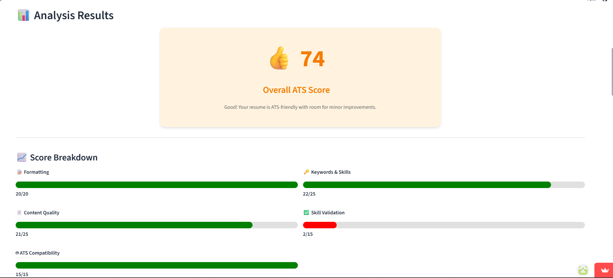
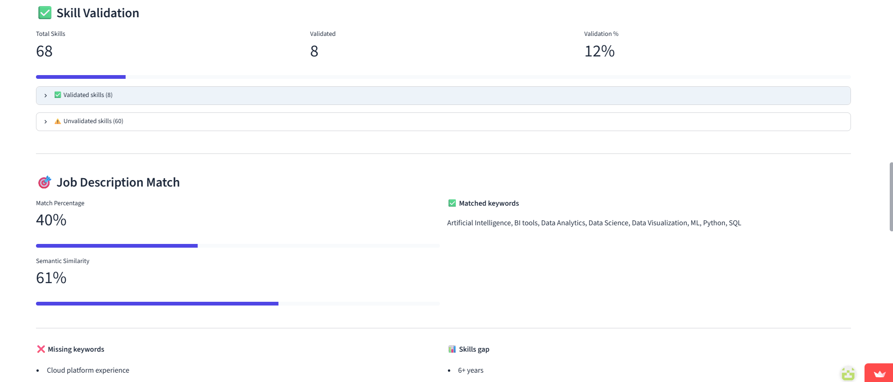
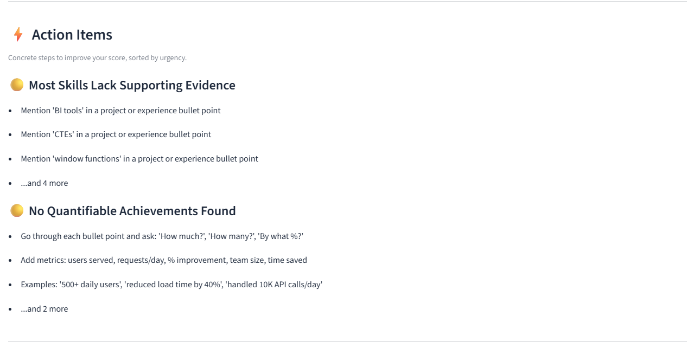
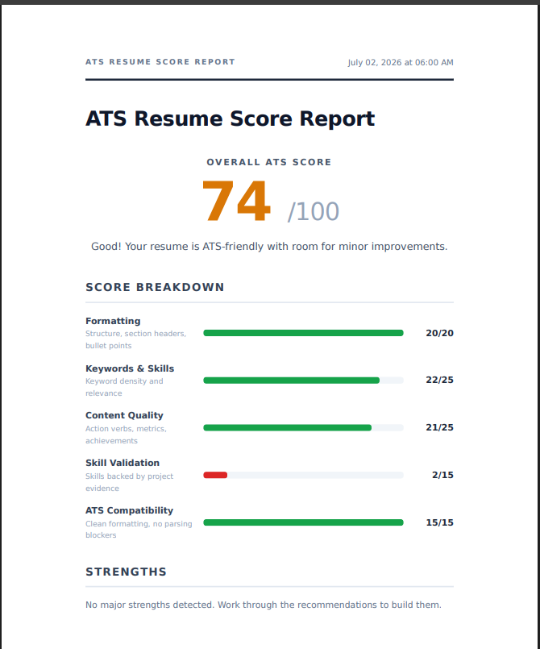
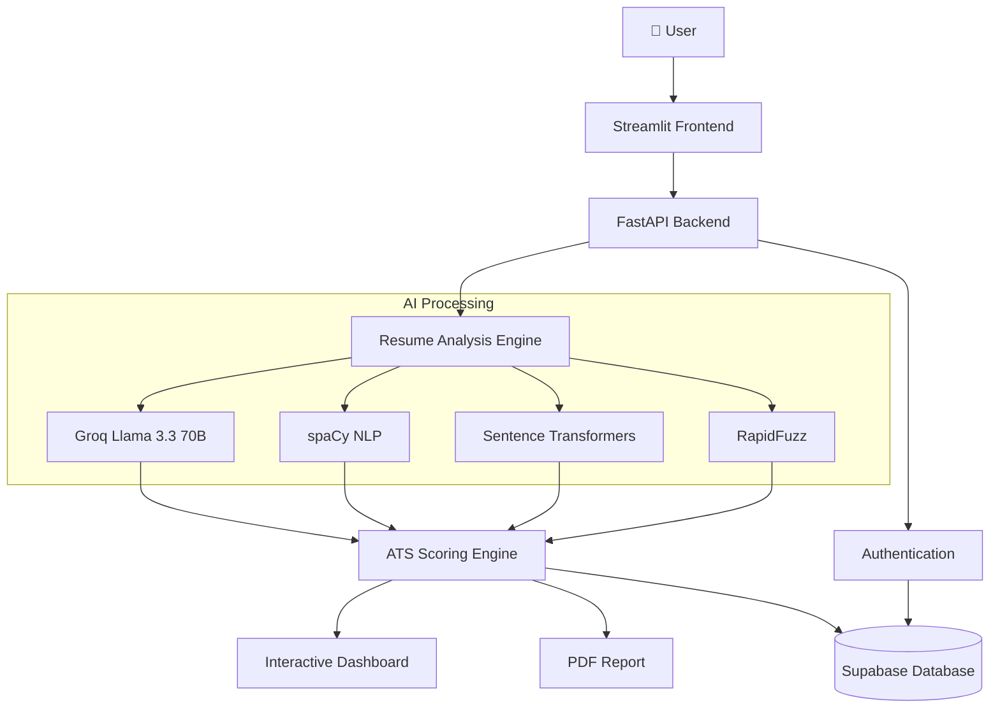
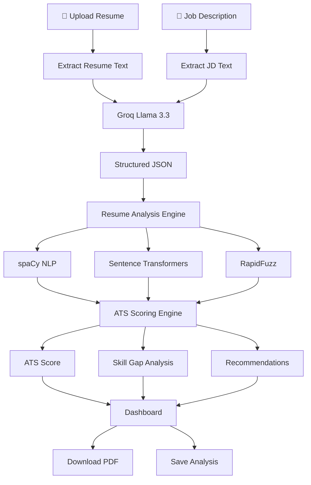

# 🎯 AI ATS Resume Analyzer

An AI-powered ATS Resume Analyzer that evaluates resumes against job descriptions using **LLMs, NLP, and semantic similarity**. Instead of relying only on keyword matching, it combines AI-powered information extraction with explainable scoring to provide actionable feedback, identify skill gaps, and improve ATS compatibility.

# 🚀 Live Demo

🌐 **Live Application:**
https://aiatsscorer-as4hlcr6yyfsqwwewicfrw.streamlit.app/

> Sign in using Email or Google OAuth to save previous analyses and download PDF reports.

---

# 🎥 Demo

<p align="center">
  
</p>

---

# 📸 Screenshots

## 📊 ATS Score Dashboard
Overall ATS score with detailed score breakdown across formatting, keywords, content quality, skill validation, and ATS compatibility.



---

## 🎯 Job Description Match & Skill Validation
Semantic resume–job description matching, keyword analysis, skill validation, and identified skill gaps.



---

## ⚡ AI-Powered Actionable Recommendations
Personalized recommendations highlighting missing evidence, quantified achievements, and resume improvements to maximize ATS compatibility.



---

## 📄 Professional PDF Report
Downloadable multi-page ATS report summarizing the analysis, score breakdown, strengths, and improvement recommendations.



---

# ✨ Features

* AI-powered resume parsing using **Groq Llama 3.3 70B**
* Resume vs Job Description semantic matching
* Explainable ATS scoring with detailed score breakdown
* Skill gap detection and personalized recommendations
* ATS keyword analysis and optimization
* Professional PDF report generation
* Resume analysis history with cloud storage
* Email & Google OAuth authentication

---

# 🏗️ System Architecture

The application follows a modular architecture with separate layers for the frontend, backend, AI processing, and data storage.


---
# 🔄 Resume Analysis Workflow

The following workflow illustrates how a resume is analyzed and transformed into an explainable ATS evaluation.


---

# 🚀 Engineering Highlights

* Hybrid AI pipeline combining **LLMs**, **spaCy NLP**, **Sentence Transformers**, and **RapidFuzz**
* Semantic resume matching beyond traditional keyword-based ATS systems
* Explainable weighted scoring instead of black-box predictions
* Modular FastAPI backend with Streamlit frontend
* Secure authentication using Supabase and JWT
* Dockerized deployment for reproducible environments

---

# 💡 Challenges Solved

* Converted unstructured resumes and job descriptions into structured JSON using LLMs.
* Combined semantic similarity with deterministic ATS scoring for more reliable evaluations.
* Designed an explainable scoring engine to provide transparent feedback instead of opaque AI outputs.
* Built a scalable architecture separating frontend, backend, AI services, and database operations.

---

# 🛠️ Tech Stack

| Category             | Technologies                               |
| -------------------- | ------------------------------------------ |
| **Frontend**         | Streamlit                                  |
| **Backend**          | FastAPI, Uvicorn                           |
| **Language**         | Python 3.11                                |
| **LLM**              | Groq (Llama 3.3 70B)                       |
| **NLP**              | spaCy                                      |
| **Embeddings**       | Sentence Transformers                      |
| **Keyword Matching** | RapidFuzz                                  |
| **Authentication**   | Supabase Authentication, Google OAuth, JWT |
| **Database**         | Supabase PostgreSQL                        |
| **PDF Generation**   | WeasyPrint, Jinja2                         |
| **Deployment**       | Docker, Hugging Face Spaces                |

---

# 📂 Project Structure

```text
AI_ATS_SCORER/
│
├── backend/                 # FastAPI backend
├── frontend/                # Streamlit frontend
├── docs/
│   ├── ats_demo.gif         # Demo GIF
│   └── images/              # README screenshots
│
├── .gitattributes
├── .gitignore
├── Dockerfile
├── README.md
└── requirements.txt
```

---

## 👨‍💻 Author

**Kumar Abhishek**

[](https://github.com/the-kr-abhishek)
[](https://www.linkedin.com/in/kumar-abhishek-14bb701b9)

⭐ If you found this project useful, consider giving it a star!
